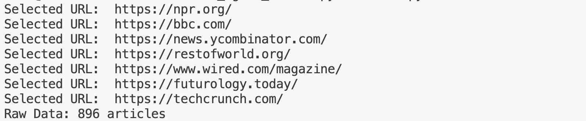
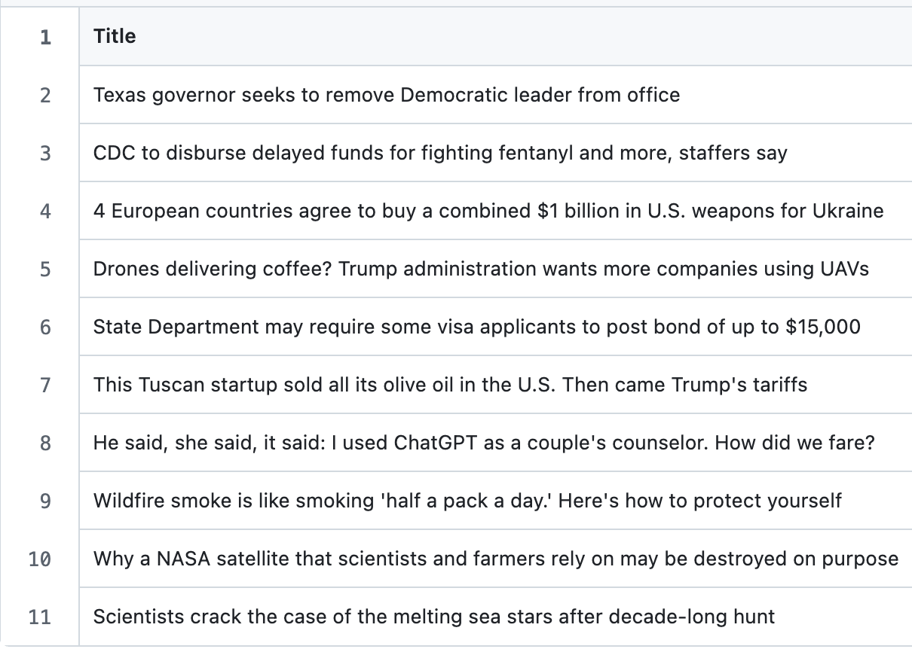

# Set Up Instructions
Navigate to your terminal.

Type in the following commands:

`git clone https://github.com/SFT-Aero/AI_agent_team.git`

`cd AI_agent_team`

`git pull origin main`

## To run on your local machine

Make sure you are running Python 3.13.5. If not, download Python 3.13.5. `python3 --version`

Make sure `pip` is installed, if needed. `python -m pip --version`

## To run on a virtual environment
`python3 -m venv myenv`

`source myenv/bin/activate`

# Run Instructions 
`pip install -r requirements.txt && python3 main.py`

Let run for 2-5 minutes until complete.

Type in the following command to retrieve the .csv file:

`mv scraped_articles.csv ~/Downloads/`

`mv general_signals.csv ~/Downloads/`

`mv economic_signals.csv ~/Downloads/`

Open your Downloads folder to retrieve the desired files.

## Potential Error Messages
This error means that the AI has reached its maximum limit of articles. Error is ok, please continue.


This error means that the OpenAI account may be out of money. Log on and check the account balance.


This error `Please commit your changes or stash them before you merge. Aborting` means that the local version is out-of-date. Run `git stash` then `git pull origin main`. Then continue.

# To Add Another URL
The OpenAI price tier limits the number of urls you are able to run. Currently, the tested limit is 4 urls, feel free to experiment with more, but you may get an error.

To add another url navigate to https://github.com/SFT-Aero/AI_agent_team/blob/main/urls.csv

Click the Edit button.


Add your url to the next newline. 

Press the green Commit changes... button. Then, Commit Changes.

Then, navigate to your terminal.

Type in the following commands:

`cd AI_agent_team`

`git pull origin main`

Then, the code should run:

`python3 main.py`

# To Update The Open AI API Key
Navigate to your terminal.

Type in the following commands:

`cd AI_agent_team`

`git pull origin main`

`touch .env`

`nano .env`

Inside this new terminal type:

`OPENAI_API_KEY="Put api key from OpenAI here"` , (with no double quotes)

Press CTRL + X key, Y key, then Return key.

`pip install python-dotenv` , this requirement should already be satisfied.

Then, the code should run:

`python3 main.py`

# AI Agent Web Scraping and Analysis

## 📌 Overview

This script automates the process of:

1. Scraping articles from a list of URLs.
2. Analyzing those articles with two AI agents.
3. Saving the results into clearly structured CSV files.

It helps identify future signals and economically disruptive trends from real-world news and articles.

---

## 🧩 What It Does

### ✅ Step 1: Scrape Articles
- **Input**: `urls.csv` — a file with a list of news article URLs.
- **Output**: `scraped_articles.csv` — raw article data (title, content, etc.).



### ✅ Step 2: Analyze with AI Agents
Two agents analyze the articles:
- **Futuristic Agent**: Detects trends and weak signals that may influence the future.
- **Disruptive Economy Agent**: Identifies signals of economic disruption or transformation.

### ✅ Step 3: Save Outputs
Each agent's results are saved to a separate file:
- `general_signals.csv` — results from the Futuristic Agent.


- `economic_signals.csv` — results from the Disruptive Economy Agent.


---

## 📂 Files & Structure

```plaintext
AI_agent_team/
├── urls.csv                  # Input: list of URLs to scrape
├── scraped_articles.csv      # Output: raw scraped articles
├── general_signals.csv       # Output: futuristic signals
├── economic_signals.csv      # Output: economic signals
└── main.py                 # The main script you run
```

## Contact & Support
For any questions or issues with the script, please contact Shandler A. Mason, shandler.mason@gmail.com, CSPS Summer 2025 MTS Graduate Intern III.

**Created by:** [Shandler A. Mason](https://shandlermason.github.io/sm-portfolio/)

