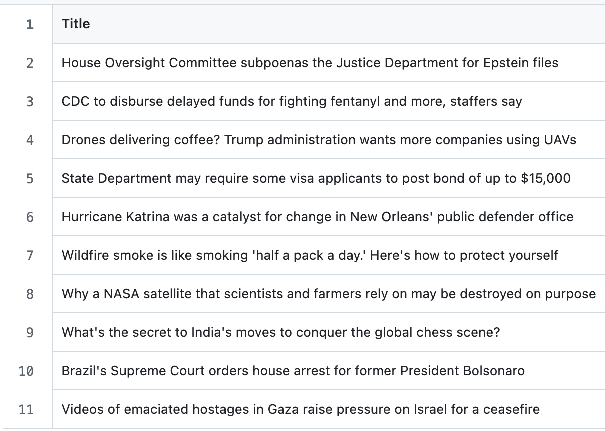

# AI Agent Web Scraping and Analysis

## 📌 Overview

This script automates the process of:

1. Scraping articles from a list of URLs.
2. Analyzing those articles with two AI agents.
3. Saving the results into clearly structured CSV files.

It helps identify future signals and economically disruptive trends from real-world news and articles.

---

## 🧩 What It Does

### ✅ Step 1: Scrape Articles
- **Input**: `urls.csv` — a file with a list of news article URLs.
- **Output**: `scraped_articles.csv` — raw article data (title, content, etc.).


### ✅ Step 2: Analyze with AI Agents
Two agents analyze the articles:
- **Futuristic Agent**: Detects trends and weak signals that may influence the future.
- **Disruptive Economy Agent**: Identifies signals of economic disruption or transformation.

### ✅ Step 3: Save Outputs
Each agent's results are saved to a separate file:
- `general_signals.csv` — results from the Futuristic Agent.


- `economic_signals.csv` — results from the Disruptive Economy Agent.


---

## 📂 Files & Structure

```plaintext
AI_agent_team/
├── urls.csv                  # Input: list of URLs to scrape
├── scraped_articles.csv      # Output: raw scraped articles
├── general_signals.csv       # Output: futuristic signals
├── economic_signals.csv      # Output: economic signals
└── main.py                 # The main script you run
```

## Contact & Support
For any questions or issues with the script, please contact Shandler A. Mason, shandler.mason@gmail.com, CSPS Summer 2025 MTS Graduate Intern III.

**Created by:** [Shandler A. Mason](https://shandlermason.github.io/sm-portfolio/)

